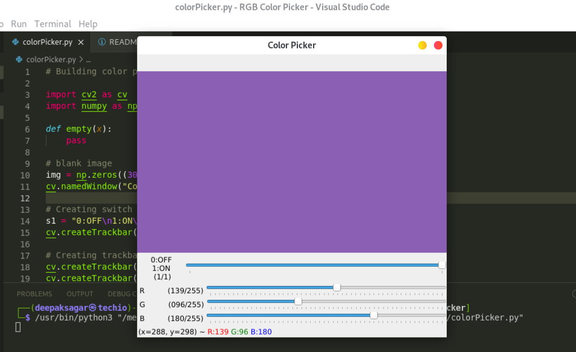

# 
Color Picker

A simple RGB color picker through trackbars using OpenCV and Python.

1. Run the program
2. To display color turn s = 1
3. Change the value of R, G and B
4. Depending on the value of R, G and B it will display the color as an image. 
   
***Preview***

